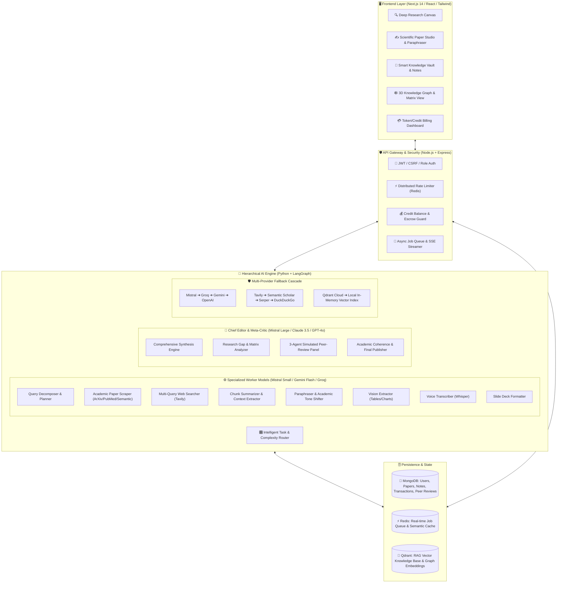
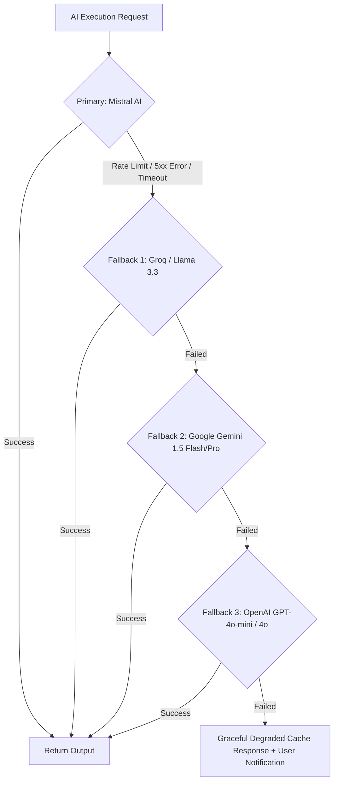
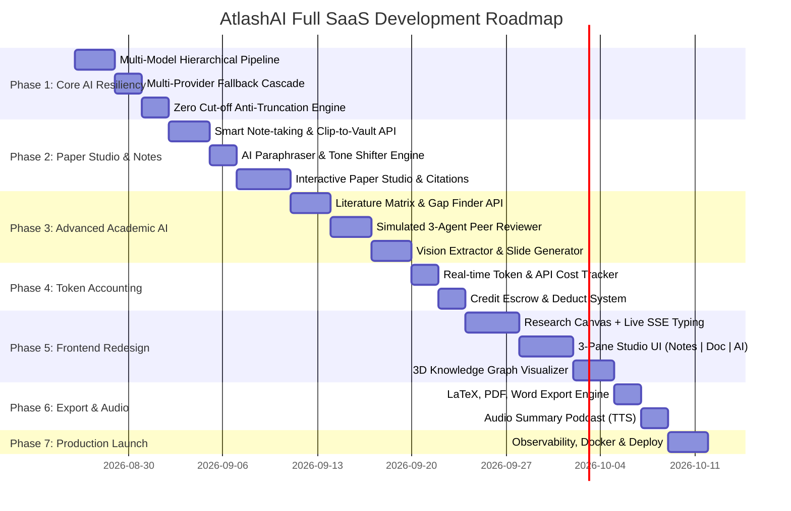

# 🌌 AtlashAI: Enterprise Multi-Agent Research, Scientific Paper Studio & Knowledge Architecture
> **Comprehensive System Blueprint, Hierarchical Multi-AI Orchestration, Resilient Fallback Engine, Academic Tools & End-to-End SaaS Roadmap**
> **Target Scale:** 100k+ Active Researchers, Sub-second UI Responsiveness, 99.99% AI Availability, Zero Hallucination & Zero Token Cut-off.

---

## 📑 সূচিপত্র (Table of Contents)
1. [🌟 প্রজেক্ট ভিশন ও কোর আর্কিটেকচার ওভারভিউ (Vision & Core Architecture)](#1-vision)
2. [🤖 হায়ারার্কিক্যাল মাল্টি-মডেল এআই অর্কেস্ট্রেশন (Hierarchical Multi-Model AI Orchestration)](#2-hierarchical-ai)
3. [🛡️ জিরো-ফেইলিউর মাল্টি-প্রোভাইডার ফলব্যাক ক্যাস্কেড (Resilient Fallback Cascade)](#3-fallback-cascade)
4. [📝 ইন্টারেক্টিভ রিসার্চ পেপার স্টুডিও, প্যারাফ্রেজার ও স্মার্ট নোটপ্যাড (Paper Studio & Notes)](#4-paper-studio)
5. [🔬 নেক্সট-জেন অ্যাডভান্সড এআই ফিচারসমূহ (Next-Gen Advanced AI Modules)](#5-advanced-features)
   * 5.1 [Literature Matrix & Research Gap Finder](#51-gap-finder)
   * 5.2 [Simulated Multi-Agent Peer-Reviewers](#52-peer-review)
   * 5.3 [Multi-Modal Table & Graph Vision Extractor](#53-vision-extractor)
   * 5.4 [Direct Academic API Integration (ArXiv, PubMed, Semantic Scholar)](#54-academic-apis)
   * 5.5 [AI Originality & Humanizer Guard](#55-humanizer)
   * 5.6 [3D/2D Visual Knowledge Graph & Mind-Map](#56-knowledge-graph)
   * 5.7 [Voice-to-Research Memo (Whisper AI)](#57-voice-memo)
   * 5.8 [One-Click Slide Deck Generator (PPTX / Marp)](#58-slide-generator)
6. [⚡ লেটেন্সি অপ্টিমাইজেশন ও অ্যান্টি-কাটঅফ টোকেন ইঞ্জিন (Latency & Anti-Cutoff Engine)](#6-latency-token)
7. [💰 টোকেন কস্ট অ্যাকাউন্টিং, ক্রেডিট সিস্টেম ও মোনেটাইজেশন (Economics & Billing)](#7-token-billing)
8. [🗄️ সিস্টেম ডেটাবেজ স্কিমা ও স্টেট ম্যানেজমেন্ট (Database Schemas)](#8-database-schemas)
9. [🗺️ এন্ড-টু-এন্ড স্টেপ-বাই-স্টেপ ইমপ্লিমেন্টেশন রোডম্যাপ (Phase 1 - 7 Roadmap)](#9-roadmap)

---

<a name="1-vision"></a>
## 🌟 ১. প্রজেক্ট ভিশন ও কোর আর্কিটেকচার ওভারভিউ (Vision & Core Architecture)

AtlashAI শুধুমাত্র একটি সার্চ ইঞ্জিন বা চ্যাটবট নয়। এটি হচ্ছে **Perplexity + Notion + Overleaf + Consensus + Jenni AI + SciSpace**-এর সমন্বয়ে তৈরি একটি অল-ইন-ওয়ান **Enterprise AI Research, Scientific Paper Writing & Academic Discovery Suite**।

### 🏛️ হাই-লেভেল সিস্টেম আর্কিটেকচার ডায়াগ্রাম



---

<a name="2-hierarchical-ai"></a>
## 🤖 ২. হায়ারার্কিক্যাল মাল্টি-মডেল এআই অর্কেস্ট্রেশন (Hierarchical Multi-Model AI Orchestration)

সব কাজের জন্য বড় ও ব্যয়বহুল মডেল ব্যবহার করলে সিস্টেম স্লো এবং খরুচে হয়ে যায়। তাই আমরা **Worker-Master Architecture** ব্যবহার করব:

### ক. ছোট ও দ্রুতগতির Worker AI (Specialized Micro-Agents)
* **ব্যবহৃত মডেল:** `Mistral-Small-Latest`, `Gemini 1.5 Flash`, `Llama-3.3-70B (via Groq - 500+ tokens/sec)`, `Groq Whisper`
* **কাজের পরিধি:**
  1. **Query Planner Agent:** বড় টপিককে ৪-৫টি সাব-টপিক ও একাডেমিক সার্চ কোয়েরিতে রূপান্তর।
  2. **Academic & Web Scraper Agent:** ArXiv, PubMed ও ওয়েবের জটিল পেপার থেকে অহেতুক অংশ বাদ দিয়ে মূল মেথডোলজি, রেজাল্ট ও সাইটেশন সামারি বের করা।
  3. **Paraphrase & Rephrase Worker:** ব্যবহারকারীর ড্রাফট করা প্যারাগ্রাফ বিভিন্ন টোনে (Academic, Simplified, Formal, Humanized) রূপান্তর করা।
  4. **Multi-Modal Vision Agent:** চার্ট, গ্রাফ এবং টেবিল রিড করে LaTeX Table / Markdown-এ রূপান্তর।
  5. **Voice Memo Agent:** অডিও লেকচার/নোটকে টেক্সটে রূপান্তর করে পেপারে ইনসার্ট করা।

### খ. শক্তিশালী Master AI (Chief Editor & Meta-Critic)
* **ব্যবহৃত মডেল:** `Mistral-Large-Latest`, `Claude 3.5 Sonnet`, বা `GPT-4o`
* **কাজের পরিধি:**
  1. **Gap Analysis:** শত শত পেপারের তুলনামূলক ম্যাট্রিক্স তৈরি ও গবেষণার অপূর্ণ দিক চিহ্নিত করা।
  2. **Peer Review Simulation:** জার্নাল রিভিউয়ারদের মতো পেপারের কঠোর মূল্যায়ন করা।
  3. **Final Publication Synthesis:** পুরো রিসার্চ পেপারকে সর্বোচ্চ প্রাতিষ্ঠানিক স্ট্যান্ডার্ডে কম্পোজ করা।

```
[User Query / Topic]
        │
        ▼
[Task Router] ──(Decomposes Task)──► [Fast Worker AI Cluster]
                                            │ (Runs in Parallel: 2-3 sec)
                                            ▼
                              [Aggregated Evidence & Drafts]
                                            │
                                            ▼
                               [Master Chief Editor AI]
                       (Audit Hallucinations + Synthesize Report)
                                            │
                                            ▼
                               [Final Verified Response]
```

---

<a name="3-fallback-cascade"></a>
## 🛡️ ৩. জিরো-ফেইলিউর মাল্টি-প্রোভাইডার ফলব্যাক ক্যাস্কেড (Resilient Fallback Cascade)

একটি প্রোডাকশন সিস্টেমে কোনো একটি API (যেমন Mistral বা Tavily) ডাউন হলে পুরো সিস্টেম ডাউন হওয়া চলবে না। এর জন্য **Failover Circuit Breaker** থাকবে:



### ফলব্যাক টেবিল:

| কম্পোনেন্ট | Primary Provider | Fallback 1 | Fallback 2 | Fallback 3 |
| :--- | :--- | :--- | :--- | :--- |
| **Worker LLM** | Mistral Small | Groq Llama 3.3 | Gemini 1.5 Flash | GPT-4o-mini |
| **Master Editor** | Mistral Large | Claude 3.5 Sonnet | GPT-4o | Gemini 1.5 Pro |
| **Search Engine** | Tavily API | Semantic Scholar API | Serper.dev (Google) | DuckDuckGo Search |
| **Job Queue & Cache** | Upstash Redis | Local In-Memory LRU | MongoDB Fallback Queue | - |
| **Vector DB** | Qdrant Cloud | Local Chroma / In-Memory | Postgres pgvector | - |

---

<a name="4-paper-studio"></a>
## 📝 ৪. ইন্টারেক্টিভ রিসার্চ পেপার স্টুডিও, প্যারাফ্রেজার ও স্মার্ট নোটপ্যাড (Paper Studio & Notes)

```
┌──────────────────────────────────────────────────────────────────────────────┐
│  AtlashAI Scientific Paper Studio & Research Canvas                          │
├──────────────────────┬───────────────────────────────┬───────────────────────┤
│ 📚 Smart Notes &     │ ✍️ Interactive Paper Editor   │ 🔍 Live Deep Research │
│    Citations Vault   │                               │    & AI Assistant     │
│                      │ # Climate Change & Crop Yield │                       │
│ • [Note 1] Heatwave  │ In recent decades, climate    │ [Topic: Soil Biology] │
│   data 2024 (Link)   │ volatility has drastically    │                       │
│ • [Note 2] Drought   │ altered crop yields [1].      │ ⚡ 4 Sources found:   │
│   resistant maize    │                               │  1. Nature.com (98%)  │
│                      │ [AI Co-Pilot Bar:             │  2. ScienceDirect     │
│ [➕ Clip to Notes]    │  Paraphrase | Academic Polish │                       │
│ [🔗 Insert Citation] │  | Generate Methodology]      │ [👉 Send to Editor]   │
└──────────────────────┴───────────────────────────────┴───────────────────────┘
```

### ১. Scientific Paper Studio (WYSIWYG / Markdown Editor)
* **Live AI Co-Pilot:** ইউজার লেখার সময় `++` বা `Cmd+K` চাপলে AI স্বয়ংক্রিয়ভাবে পরবর্তী প্যারাগ্রাফ সাজেস্ট করবে বা ফ্যাক্ট চেক করবে।
* **Section Generator:** এক ক্লিকে "Generate Literature Review", "Abstract", "Methodology" বা "References" তৈরি হবে।
* **One-Click Citation Insert:** রিসার্চে পাওয়া যেকোনো ভেরিফাইড পেপারের সাইটেশন সরাসরি পেপারের মধ্যে `[APA / IEEE / BibTeX / Harvard]` ফরম্যাটে ইনসার্ট করা যাবে।

### ২. Smart Paraphraser & Tone Shifter
* **Paraphrase Modes:**
  * 🎓 **Academic / Formal:** জটিল বাক্যকে রিসার্চ জার্নাল উপযোগী ভাষায় রূপান্তর।
  * 💡 **Simplify / ELI5:** কঠিন কনসেপ্টকে সহজ ভাষায় প্রকাশ।
  * ⚡ **Executive Summary:** বড় প্যারাগ্রাফকে ৩টি বুলেট পয়েন্টে রূপান্তর।
  * 🛡️ **Humanize & Fluency:** এআই-এর রোবোটিক টোন দূর করে ন্যাচারাল লেখার ফ্লো আনা।

### ৩. Smart Knowledge Vault (Note-taking System)
* ডিপ রিসার্চের সময় কোনো রেজাল্ট বা আর্টিকেলের অংশ পছন্দ হলে **"Clip to Vault"** বাটনে চাপ দিয়ে ট্যাগসহ (`#soil`, `#genetics`) নোট হিসেবে সেভ করা যাবে।
* পেপার লেখার সময় এই সেভ করা নোটগুলোকে কনটেক্সট হিসেবে ব্যবহার করে ড্রাফট জেনারেট করা যাবে।

---

<a name="5-advanced-features"></a>
## 🔬 ৫. নেক্সট-জেন অ্যাডভান্সড এআই ফিচারসমূহ (Next-Gen Advanced AI Modules)

<a name="51-gap-finder"></a>
### ৫.১. 🔬 AI Literature Matrix & Research Gap Finder (গবেষণার শূন্যতা খোঁজা)
* **কী করবে:** ৫০+ পেপারের মূল ফাইন্ডিং, মেথডোলজি এবং লিমিটেশন তুলনা করে একটি গ্রিড ম্যাট্রিক্স তৈরি করবে এবং লাল রঙে **"Unresolved Research Gaps"** হাইলাইট করবে।
* **আউটপুট:** "এই বিষয়ে এ যাবৎ এক্সপেরিমেন্ট শুধু ল্যাবে হয়েছে, ফিল্ড ট্রায়ালের ডেটা নেই—এটি আপনার গবেষণার প্রধান টপিক হতে পারে।"

<a name="52-peer-review"></a>
### ৫.২. 🧑‍🏫 Simulated Multi-Agent Peer-Reviewers (ভার্চুয়াল জার্নাল রিভিউ)
* **কী করবে:** পেপার লেখার পর ৩টি আলাদা এআই পারসোনা পেপারের মূল্যায়ন করবে:
  1. **Reviewer 1 (Methodology Critic):** স্যাম্পল সাইজ, স্ট্যাটিস্টিক্যাল ভ্যালিডিটি এবং ডাটা বায়াস নিয়ে প্রশ্ন তুলবে।
  2. **Reviewer 2 (Domain Scholar):** সম্প্রতি প্রকাশিত প্রাসঙ্গিক পেপার সাইট করা হয়েছে কি না তা চেক করবে।
  3. **Reviewer 3 (Clarity & Logic Auditor):** লেখার দুর্বল যুক্তি ও অস্পষ্ট বাক্য চিহ্নিত করবে।
* **রেজাল্ট:** জার্নাল রিজেকশন রেট ৯০% কমে যাবে।

<a name="53-vision-extractor"></a>
### ৫.৩. 📊 Multi-Modal Table & Graph Vision Extractor (ভিশন এআই)
* **কী করবে:** কোনো পেপারের জটিল চার্ট, হিস্টোগ্রাম বা টেবিলের স্ক্রিনশট আপলোড করলে ভিশন মডেল ভেতরের ডেটা রিড করে **LaTeX Table**, **Markdown Table** বা **CSV Raw Data** আকারে কনভার্ট করে দেবে।

<a name="54-academic-apis"></a>
### ৫.৪. 🌐 Direct Academic API Integration (ArXiv, PubMed, Semantic Scholar)
* **সরাসরি কানেকশন:** সাধারণ ওয়েবের পাশাপাশি **Semantic Scholar (২০০M+ পেপার)**, **PubMed**, **ArXiv**, **DOAJ** এবং **CrossRef** থেকে পিয়ার-রিভিউড ওপেন-এক্সেস পেপার ফেচ করা।
* **মেটাডেটা এক্সট্রাকশন:** DOI, Citation Count, Authors, Impact Factor এবং PDF ডিরেক্ট লিঙ্ক এক ক্লিকে পাওয়া যাবে।

<a name="55-humanizer"></a>
### ৫.৫. 🛡️ AI Originality & Humanizer Guard (AI Detection Minimizer)
* **কী করবে:** টেক্সটের পারপ্লেক্সিটি (Perplexity) এবং বার্স্টিনেস (Burstiness) ব্যালেন্স করে এআই-এর ক্লিশে শব্দ (যেমন: *delve into, paramount, tapestry*) বাদ দিয়ে ন্যাচারাল হিউম্যান ফ্লো নিশ্চিত করবে।

<a name="56-knowledge-graph"></a>
### ৫.৬. 🕸️ 3D/2D Visual Knowledge Graph & Citation Mind-Map
* **কী করবে:** গবেষণার কনসেপ্ট, পেপারের যোগসূত্র এবং সাইটেশন চেইন একটি ইন্টারঅ্যাক্টিভ গ্রাফ নোড ম্যাপে দেখাবে। যেকোনো নোডে ক্লিক করলে সরাসরি সারাংশ দেখা যাবে।

<a name="57-voice-memo"></a>
### ৫.৭. 🎙️ Voice-to-Research Memo & Auto-Structuring (ভয়েস নোট)
* **কী করবে:** গবেষক ল্যাব বা ফিল্ডে থাকাকালীন মুখে যা বলবেন, তা `Groq Whisper` দিয়ে তাৎক্ষণিক ট্রান্সক্রাইব হয়ে পেপারের নির্দিষ্ট সেকশনে গুছিয়ে নোট হিসেবে যুক্ত হবে।

<a name="58-slide-generator"></a>
### ৫.৮. 📑 One-Click Slide Deck Generator (রিসার্চ থেকে প্রেজেন্টেশন)
* **কী করবে:** সম্পূর্ণ রিসার্চ পেপার বা রিপোর্ট থেকে ৫ সেকেন্ডে ১০-১৫ স্লাইডের **PowerPoint (PPTX)** বা **Marp Markdown Slides** তৈরি করে দেবে কনফারেন্স বা ডিফেন্সের জন্য।

---

<a name="6-latency-token"></a>
## ⚡ ৬. লেটেন্সি অপ্টিমাইজেশন ও অ্যান্টি-কাটঅফ টোকেন ইঞ্জিন (Latency & Anti-Cutoff Engine)

### ক. লেটেন্সি কমানোর ৩টি কোর স্ট্র্যাটেজি
1. **Parallel Execution (Async Fan-out):** কুয়েরি প্ল্যান হওয়ার সাথে সাথে ৩-৫টি সার্চ কল এবং স্ক্র্যাপিং টাস্ক একসাথে ফায়ার হবে (`asyncio.gather`)। সময় কমবে **৬৫%**।
2. **Streaming Tokens via SSE:** রিপোর্ট শেষ হওয়া পর্যন্ত অপেক্ষা না করে প্রথম শব্দ থেকেই সার্ভার-সেন্ট ইভেন্টস (`SSE`) দিয়ে ফ্রন্টএন্ডে লাইভ টাইপিং দেখাবে।
3. **Semantic Caching:** একই ধরনের কোয়েরি থাকলে Qdrant ভেক্টর ক্যাশ থেকে ০.৫ সেকেন্ডে ডেটা রিটার্ন করবে।

### খ. অ্যান্টি-কাটঅফ টোকেন লজিক (মাঝপথে বাক্য না কাটার নিশ্চয়তা)
```python
# Pseudo-logic for Zero Cut-Off Generation
def generate_robust_section(prompt, max_budget=2000):
    response = call_llm(prompt, max_tokens=max_budget)
    text = response.content
    
    # 1. Check if truncated by token limit
    if response.finish_reason == "length":
        last_phrase = text.strip()[-60:]
        continuation = call_llm(f"Continue directly from '{last_phrase}' without repetition: ...")
        text += " " + continuation.content
        
    # 2. Smart Boundary Enforcement: ensure finishes with complete sentence
    if not text.endswith(('.', '!', '?', '।', '```')):
        match = re.search(r'^(.*[.!?।])', text, re.DOTALL)
        if match:
            text = match.group(1)
            
    return text
```

---

<a name="7-token-billing"></a>
## 💰 ৭. টোকেন কস্ট অ্যাকাউন্টিং, ক্রেডিট সিস্টেম ও মোনেটাইজেশন (Economics & Billing)

### ক. টোকেন হিসাবের সমীকরণ (Cost Formula)
$$\text{Total Cost} = \sum (\text{Worker LLM Cost}) + \text{Master LLM Cost} + \text{Search Cost} + \text{Margin}$$

* **১ ক্রেডিট = \$০.০১ (১ সেন্ট)**
* **Fast Search:** ৫ ক্রেডিট (~$0.05)
* **Deep Multi-Agent Research:** ২০ ক্রেডিট (~$0.20)
* **Full Academic Paper Generation + Peer Review:** ৫০ ক্রেডিট (~$0.50)

### খ. ক্রেডিট বিলিং মডেল (Subscription Tiers)
* 🆓 **Free Plan (\$0):** ৫০ সাইনআপ ক্রেডিট, প্রতিদিন ৩টি ফাস্ট রিসার্চ, বেসিক নোটপ্যাড।
* 🚀 **Researcher Pro (\$19/মাস):** প্রতি মাসে ২০০০ ক্রেডিট, আনলিমিটেড ফাস্ট রিসার্চ, Deep Multi-Agent Research, Paper Studio, LaTeX & PDF Export, Literature Gap Matrix।
* 🏢 **Institutional / Lab (\$69/মাস):** ১০০০০ ক্রেডিট, মাল্টি-ইউজার শেয়ার্ড ওয়ার্কস্পেস, AI Peer Review Simulation, Custom PDF/BYOD RAG আপলোড, প্রাইওরিটি কিউ।

---

<a name="8-database-schemas"></a>
## 🗄️ ৮. সিস্টেম ডেটাবেজ স্কিমা ও স্টেট ম্যানেজমেন্ট (Database Schemas)

### MongoDB Models (`MultiAgentPart-Backend-New/src/app/modules/`)

```typescript
// 1. User & Wallet Schema
interface IUser {
  _id: ObjectId;
  name: string;
  email: string;
  role: 'user' | 'admin' | 'researcher';
  credits: number;           // Remaining balance
  subscriptionTier: 'free' | 'pro' | 'enterprise';
}

// 2. Paper Studio Document Schema
interface IPaper {
  _id: ObjectId;
  userId: ObjectId;
  title: string;
  contentMarkdown: string;   // Rich text paper content
  citations: Array<{
    citationKey: string;     // e.g. "[1]"
    title: string;
    url: string;
    doi?: string;
    authors?: string[];
    year?: string;
  }>;
  peerReviewResults?: {
    overallScore: number;
    methodologyFeedback: string;
    domainFeedback: string;
    clarityFeedback: string;
  };
  attachedNotes: ObjectId[];
  updatedAt: Date;
}

// 3. Smart Knowledge Notes Schema
interface INote {
  _id: ObjectId;
  userId: ObjectId;
  title: string;
  content: string;
  sourceUrl?: string;
  tags: string[];
  embeddingId?: string;      // Synced in Qdrant for RAG
  audioUrl?: string;         // If voice-memo
  createdAt: Date;
}

// 4. Token Consumption Audit Log Schema
interface ITokenAuditLog {
  userId: ObjectId;
  jobId: string;
  action: 'deep_research' | 'paraphrase' | 'paper_gen' | 'peer_review' | 'vision_extract';
  workerTokens: { input: number; output: number; model: string };
  masterTokens: { input: number; output: number; model: string };
  searchQueriesCount: number;
  creditsDeducted: number;
  createdAt: Date;
}
```

---

<a name="9-roadmap"></a>
## 🗺️ ৯. এন্ড-টু-এন্ড স্টেপ-বাই-স্টেপ ইমপ্লিমেন্টেশন রোডম্যাপ (Phase 1 - 7 Roadmap)



### বিস্তারিত ধাপসমূহ:

#### 🔹 Phase 1: Multi-Model AI Engine, Fallback & Anti-Cutoff System
* **টাস্ক ১.১:** `pipeline/model.py`-তে Worker Models (`Mistral Small`, `Groq Llama 3.3`, `Gemini Flash`) এবং Master Models (`Mistral Large`, `Claude 3.5`, `GPT-4o`) কনফিগারেশন।
* **টাস্ক ১.২:** `pipeline/fallback.py` তৈরি করা যাতে প্রাইমারি API ফেইল করলে অটোমেটিক ফলব্যাক মডেলে শিফট করে।
* **টাস্ক ১.৩:** `pipeline/chains.py`-তে সেকশন-ভিত্তিক জেনারেশন ও অটো-কন্টিনিউয়েশন যুক্ত করা যাতে কোনো বাক্য কাটা না পড়ে।

#### 🔹 Phase 2: Scientific Paper Studio, Paraphraser & Knowledge Notes
* **টাস্ক ২.১:** Node.js ব্যাকএন্ডে `Paper` এবং `Note` মডিউল (CRUD APIs, Citation Linker) তৈরি।
* **টাস্ক ২.২:** Python Agent-এ প্যারাফ্রেজিং ও টোন শিফটার মাইক্রো-সার্ভিস এন্ডপয়েন্ট তৈরি (`/api/v1/paraphrase`)।
* **টাস্ক ২.৩:** নোটগুলোকে Qdrant ভেক্টরে স্টোর করে ব্যবহারকারীর নিজস্ব পেপার লেখার সময় RAG ড্রাফটিং সক্ষম করা।

#### 🔹 Phase 3: Advanced Academic AI Modules
* **টাস্ক ৩.১:** **Literature Gap Finder** অ্যালগরিদম তৈরি (ম্যাট্রিক্স গ্রিড ও রিসার্চ অপরচুনিটি ডিটেকশন)।
* **টাস্ক ৩.২:** **Simulated 3-Agent Peer-Review Panel** তৈরি (Methodology, Domain, Logic)।
* **টাস্ক ৩.৩:** **Vision Table/Chart Extractor** এবং **Slide Deck (Marp) Generator** যুক্ত করা।

#### 🔹 Phase 4: Token Cost Calculation & Credit Ledger
* **টাস্ক ৪.১:** প্রতিটি এজেন্টের রেসপন্স মেটাডেটা থেকে `usage.prompt_tokens` এবং `usage.completion_tokens` সংগ্রহ।
* **টাস্ক ৪.২:** Node.js ব্যাকএন্ডে প্রিসাইজ ক্রেডিট ডিডাকশন এবং অডিট লগিং ইমপ্লিমেন্টেশন।

#### 🔹 Phase 5: Frontend Full UX Overhaul (Next.js 14)
* **টাস্ক ৫.১:** ৩-প্যানেল লেআউট ডিজাইন: বামে **Smart Notes/Vault**, মাঝে **WYSIWYG Paper Editor**, ডানে **Live Deep Research Assistant**।
* **টাস্ক ৫.২:** সাইটেশন হোভার প্রিভিউ কার্ড এবং ১-ক্লিকে রেফারেন্স পেপারে যোগ করার ফিচার।
* **টাস্ক ৫.৩:** 3D/2D ইন্টারঅ্যাক্টিভ নলেজ গ্রাফ ভিউয়ার ইন্টিগ্রেশন।

#### 🔹 Phase 6: Multi-Format Export Studio & Audio Summary
* **টাস্ক ৬.১:** পেপারকে এক ক্লিকে **IEEE/Nature Format PDF**, **LaTeX (.tex)**, এবং **Word (.docx)**-এ এক্সপোর্ট করার ইঞ্জিন তৈরি।
* **টাস্ক ৬.২:** রিসার্চের ১-২ মিনিটের অডিও পডকাস্ট সারাংশ জেনারেট করার জন্য Fast TTS ইন্টিগ্রেশন।

#### 🔹 Phase 7: Production Hardening & Cloud Deployment
* **টাস্ক ৭.১:** Dockerfile এবং Docker Compose অপ্টিমাইজেশন।
* **টাস্ক ৭.২:** LangSmith / Helicone দিয়ে AI পারফরম্যান্স মনিটরিং এবং Sentry এরর ট্র্যাকিং যুক্ত করা।

---
> 💡 **নোট:** এই মাস্টার ব্লুপ্রিন্ট অনুযায়ী কাজ সম্পন্ন হলে AtlashAI বিশ্বমানের একটি AI Research Suite হিসেবে প্রতিষ্ঠিত হবে।
